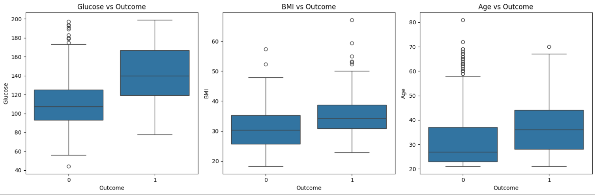
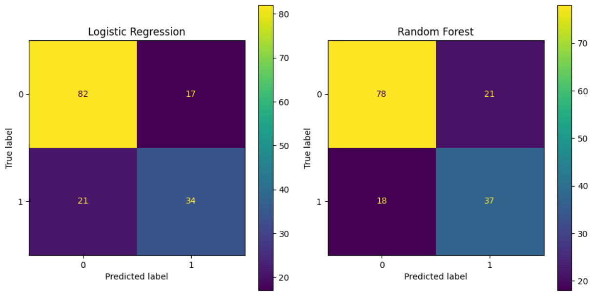

# Type 2 Diabetes Risk Prediction
This project focuses on predicting the risk of Type 2 Diabetes using machine learning techniques. The goal is to explore the dataset, understand key patterns, and build models capable of identifying high-risk patients.

## Project Overview
Diabetes is a chronic condition that requires early detection to prevent complications. In this project, we:
* Performed data cleaning and preprocessing
* Conducted exploratory data analysis (EDA)
* Investigated correlations between clinical variables
* Trained and evaluated machine learning models
* Predicted outcomes for new patients

## Dataset
The dataset used is the well-known Pima Indians Diabetes Dataset, containing medical information such as:
* Glucose
* Blood Pressure
* BMI
* Insulin
* Age
* Diabetes Pedigree Function
* Outcome (0 = Non-diabetic, 1 = Diabetic)

## Technologies Used
* Python
* Pandas
* NumPy
* Matplotlib & Seaborn
* Scikit-learn

## Data Preprocessing
Several preprocessing steps were applied:
* Replaced biologically impossible values (0) with NaN in key columns
* Imputed missing values using the median (robust to outliers)
* Checked data consistency before model training

## Exploratory Data Analysis
Key insights:

The dataset is imbalanced (~65% non-diabetic, ~35% diabetic)

Glucose showed the strongest correlation with diabetes

BMI and Age also presented significant relationships

Statistical tests (Pearson correlation) confirmed that these relationships are statistically significant (p < 0.05).

### Features vs Outcome

The boxplots reveal clear differences in the distribution of key variables between diabetic and non-diabetic patients.

- **Glucose** shows the most significant separation, with diabetic patients presenting consistently higher values and a higher median, indicating strong predictive relevance.
- **BMI** also displays a noticeable upward shift in diabetic cases, although with some overlap between the groups.
- **Age** demonstrates a moderate association, with diabetic patients tending to be older on average.

Despite some overlap between classes, these patterns suggest that higher values in these features are associated with increased diabetes risk, supporting their importance in the predictive models.

## Models Used
Two machine learning models were trained:
* Logistic Regression
* Random Forest Classifier

Training Setup
* Train-test split: 80/20
* Random state: 42

## Model Performance
Both models achieved similar performance:
* Accuracy: ~75%
* Logistic Regression performed slightly better overall

Key Differences

Logistic Regression
* Better at identifying non-diabetic patients

Random Forest
* Slightly better at detecting diabetic patients
* Fewer false negatives → safer in medical context

## Predictions on New Data
The models were tested on a new dataset of patients:

6 patients classified as diabetic

4 patients classified as non-diabetic

Both models agreed on all predictions

Insights:

High-risk patients had:
* High Glucose
* High BMI
* Older age

## Limitations
* Small dataset (768 samples)
* Class imbalance
* Simple imputation method (median)
* Limited feature engineering

## Conclusion

This project demonstrates the application of machine learning to predict Type 2 Diabetes risk, achieving approximately 75% accuracy across both models.

A deeper evaluation reveals important differences: while Logistic Regression presented more balanced performance, Random Forest showed a stronger ability to identify diabetic patients, reducing false negatives — a critical aspect in healthcare scenarios.

The analysis also confirmed Glucose, BMI, and Age as the most relevant predictors, consistent with established clinical knowledge and reinforcing the reliability of the findings.

However, the results are influenced by some limitations, including the relatively small dataset, class imbalance, and the use of simplified preprocessing approaches. These factors impact the model’s ability to generalize and accurately capture more complex patterns in the data.

### Confusion Matrix

The confusion matrices highlight the performance differences between the two models.

Logistic Regression correctly identified 82 non-diabetic and 34 diabetic patients, while Random Forest correctly classified 78 non-diabetic and 37 diabetic cases. Notably, Random Forest achieved a higher number of true positives (37 vs 34), indicating a better ability to detect diabetic patients.

However, this comes at the cost of a slightly higher number of false positives. Both models show some difficulty in identifying all diabetic cases, which is reflected in the presence of false negatives, an important limitation in medical prediction tasks.

